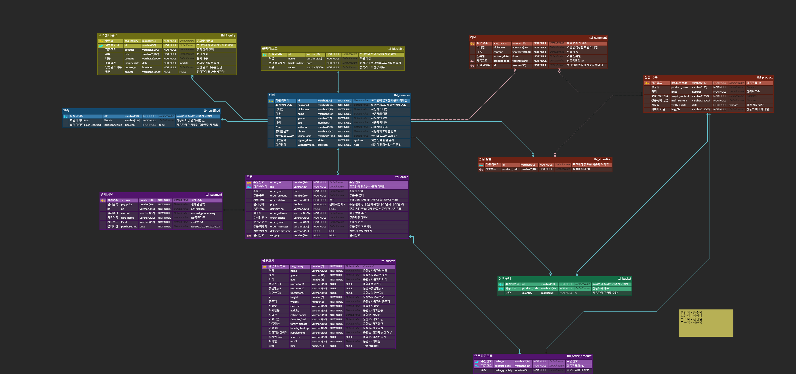

A personalized nutritional supplement subscription service using Jsp.

- - -

### 프로젝트 기간
#### 2021-12-03 ~ 2021-12-17

### 프로젝트 명
#### SUITED(영양제 맞춤 구독 서비스)

### 프로젝트 인원
#### 5명

### 개발환경
+ Language : Java
+ DBMS : Oracle11g
+ Frontend : HTML, CSS, javascript, jsp/servlet
+ Library : Jquery, ojdbc, JSTL , cos , gson , Bootstrap5
+ Server : Apache Tomca 8.5
+ Control : GitHub
+ IDE : Eclipse, SQL Developer, VS Code

- - -
### Use Case Diagram

- - -
### Entity-Relationship Diagram

